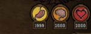
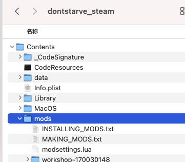
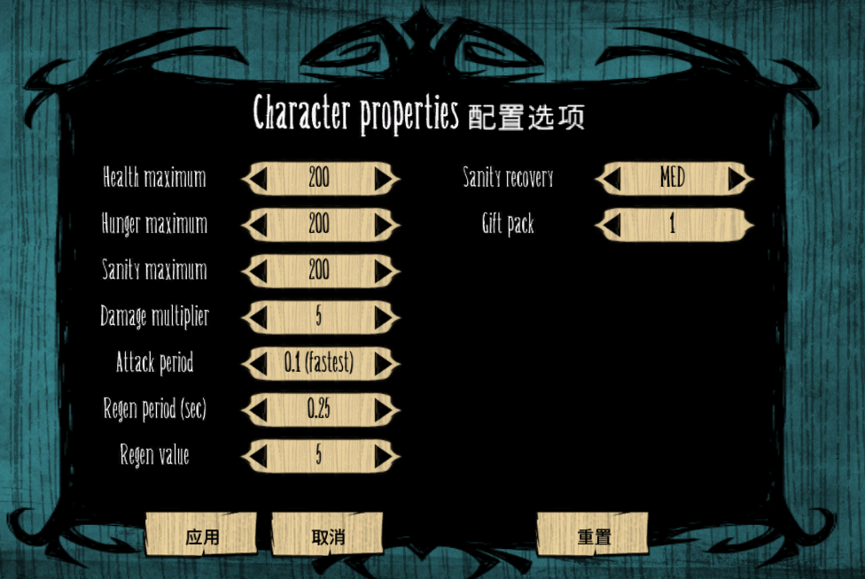

Don't starve mod - character-properties
=======================================
[简体中文](README.md) | ENGLISH

## Modify character properties

- Modify maximum of play's hungry / sanity / healthy
- Modify sanity / healthy recovery
- Modify attack damage and period
- Get any items when game start

# Usage

1. Clone to *Don't Starve* folder
    
2. Enable and configure this mod
    

